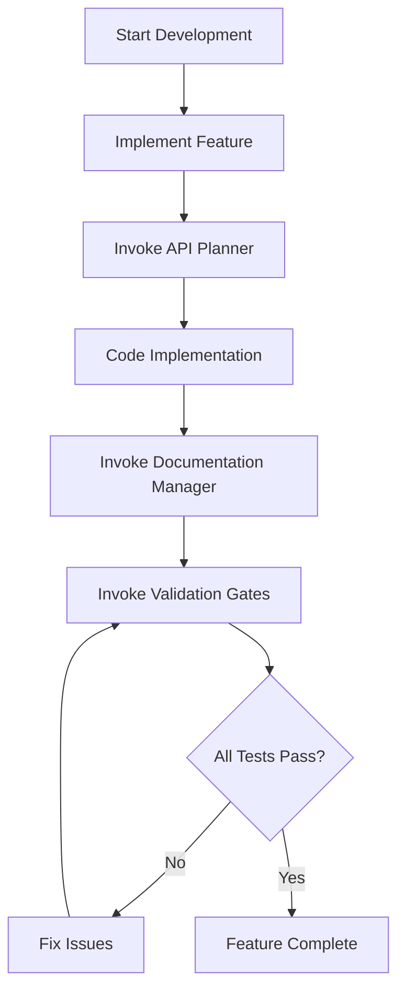

# 🤖 Claude Code Agents - Text-to-Speech Extension

This directory contains specialized AI agents designed specifically for the Intelligent Text-to-Speech Browser Extension project. These agents provide expert assistance for different aspects of extension development, from API integration to documentation management and quality assurance.

## 🎯 Agent System Overview

### What are Claude Code Agents?

Claude Code agents are specialized AI assistants that can be invoked during development to provide domain-specific expertise. Each agent is configured with specific knowledge, tools, and responsibilities to handle particular aspects of the TTS extension development workflow.

#### Key Benefits
- **Domain Expertise**: Each agent specializes in specific areas (APIs, documentation, testing)
- **Context Awareness**: Agents understand the TTS extension project structure and requirements
- **Automated Quality**: Proactive validation and documentation maintenance
- **Efficient Development**: Reduce context switching by delegating specialized tasks

## 📁 Available Agents

### 1. 🌐 API Planner Agent (`api-planner.md`)

**Purpose**: AI Services Integration Specialist for Browser Extensions

**Specialization**: 
- Groq and Claude API integrations with browser extension context
- Security-first implementation planning
- Privacy compliance and user consent management
- Cross-browser compatibility for AI services

**Key Capabilities**:
- ✅ **Documentation Retrieval**: Fetches current AI service documentation
- ✅ **Security Analysis**: Evaluates API key storage, CSP compliance, CORS policies
- ✅ **Implementation Planning**: Creates browser extension-ready integration plans
- ✅ **Multi-Provider Architecture**: Designs fallback strategies (Groq → Claude → local)
- ✅ **Rate Limiting**: Implements proper throttling (Groq: 100/hr, Claude: 60/min)
- ✅ **Privacy-First Design**: Ensures user consent and data protection

**When to Use**:
- Integrating AI explanation services
- Setting up API authentication in extensions
- Designing fallback mechanisms between AI providers
- Solving CORS or CSP issues with AI APIs
- Planning privacy-compliant AI features

**Example Invocation**:
```bash
# User mentions AI API integration
claude-code invoke api-planner "I need to integrate Groq API for text explanations"
```

### 2. 📚 Documentation Manager Agent (`documentation-manager.md`)

**Purpose**: Expert documentation specialist for maintaining comprehensive project documentation

**Specialization**:
- Proactive documentation updates when code changes
- README accuracy and synchronization
- Technical documentation maintenance
- Code-to-documentation consistency

**Key Capabilities**:
- ✅ **Synchronized Updates**: Automatically updates docs when code changes
- ✅ **Structure Management**: Maintains proper documentation organization
- ✅ **Quality Standards**: Ensures clear, tested, and accurate documentation
- ✅ **Cross-Referencing**: Links related documentation sections
- ✅ **Validation**: Checks links, code examples, and setup instructions

**Responsibilities**:
- Update README.md for project changes
- Maintain API documentation accuracy
- Create migration guides for breaking changes
- Ensure code examples work correctly
- Organize documentation structure

**When to Use**:
- After implementing new features
- When API interfaces change
- After dependency updates
- When adding new configuration options
- Before releases to ensure docs are current

**Example Invocation**:
```bash
# After making code changes
claude-code invoke documentation-manager "Updated TTS service with new voice selection features"
```

### 3. ✅ Validation Gates Agent (`validation-gates.md`)

**Purpose**: Testing and validation specialist ensuring code quality through comprehensive validation

**Specialization**:
- Automated testing execution and validation
- Quality gate enforcement
- Iterative fix processes until all tests pass
- Test coverage management

**Key Capabilities**:
- ✅ **Comprehensive Testing**: Runs unit, integration, and E2E tests
- ✅ **Code Quality**: Executes linting, formatting, and type checking
- ✅ **Iterative Fixes**: Continues fixing issues until all tests pass
- ✅ **Coverage Analysis**: Ensures adequate test coverage for new code
- ✅ **Build Validation**: Verifies successful builds across all browsers

**Validation Checklist**:
- [ ] All unit tests pass
- [ ] Integration tests pass
- [ ] Cross-browser E2E tests pass
- [ ] Linting produces no errors (ESLint)
- [ ] Code formatting is correct (Prettier)
- [ ] Type checking passes (TypeScript)
- [ ] Build succeeds for all browsers (Chrome, Firefox, Safari, Edge)
- [ ] No security vulnerabilities detected
- [ ] Manifest V3 compliance validated
- [ ] Accessibility tests pass (WCAG 2.1 AA)

**When to Use**:
- After implementing new features
- Before creating pull requests
- When tests are failing and need systematic fixing
- After dependency updates
- Before releases

**Example Invocation**:
```bash
# After feature implementation
claude-code invoke validation-gates "Implemented TTS overlay component with voice selection and accessibility features"
```

## 🔄 Agent Workflow Integration

### Development Process with Agents



### Agent Coordination Examples

#### **1. New AI Feature Development**
```bash
# Step 1: Plan API integration
claude-code invoke api-planner "Add Groq API for content explanations"

# Step 2: Implement based on agent's plan
# ... implementation code ...

# Step 3: Update documentation
claude-code invoke documentation-manager "Added AI explanation service with Groq integration"

# Step 4: Validate implementation
claude-code invoke validation-gates "AI explanation feature with secure API key management and rate limiting"
```

#### **2. Cross-Browser Feature Addition**
```bash
# Step 1: Plan browser compatibility
claude-code invoke api-planner "Ensure TTS service works on Safari with speech synthesis limitations"

# Step 2: Implement cross-browser solution
# ... implementation code ...

# Step 3: Update compatibility documentation
claude-code invoke documentation-manager "Updated TTS service for Safari compatibility and mobile support"

# Step 4: Validate across all browsers
claude-code invoke validation-gates "Cross-browser TTS implementation with Safari-specific voice loading"
```

## 🛠️ Agent Configuration

### Agent Metadata Structure

Each agent is configured with:
- **name**: Unique identifier for the agent
- **description**: When and how to use the agent
- **tools**: Available tools for the agent (Read, Write, Edit, Bash, etc.)
- **model**: AI model to use (typically "sonnet" for quality)
- **color**: UI color coding for the agent

### Agent Tools Access

| Agent | Read | Write | Edit | MultiEdit | Bash | Grep | Glob | TodoWrite |
|-------|------|-------|------|-----------|------|------|------|-----------|
| **api-planner** | ✅ | ✅ | ✅ | ✅ | ✅ | ✅ | ✅ | ✅ |
| **documentation-manager** | ✅ | ✅ | ✅ | ✅ | ❌ | ✅ | ✅ | ❌ |
| **validation-gates** | ✅ | ❌ | ✅ | ✅ | ✅ | ✅ | ✅ | ✅ |

## 🎨 Agent Customization

### Creating New Agents

To create a new agent for the TTS extension:

1. **Create agent file**: `.claude/agents/your-agent.md`
2. **Define metadata**:
   ```yaml
   ---
   name: your-agent
   description: "Agent description and usage scenarios"
   tools: Read, Write, Edit
   model: sonnet
   color: blue
   ---
   ```
3. **Write agent instructions**: Define the agent's role, responsibilities, and behavior
4. **Test the agent**: Use `claude-code invoke your-agent "test prompt"`

### TTS Extension-Specific Agent Template

```yaml
---
name: tts-feature-agent
description: "Specialized agent for TTS extension features"
tools: Read, Write, Edit, MultiEdit, Bash, Grep, Glob
model: sonnet
color: purple
---

You are a TTS Extension Feature Specialist. Your expertise includes:

1. **Web Speech API Integration**
   - SpeechSynthesis implementation
   - Voice selection and management
   - Cross-browser compatibility

2. **Browser Extension Architecture**
   - Manifest V3 compliance
   - Content script communication
   - Background service workers

3. **Accessibility Standards**
   - WCAG 2.1 AA compliance
   - Screen reader compatibility
   - Keyboard navigation

When activated, analyze TTS-specific requirements and provide implementation guidance that follows project patterns and security standards.
```

## 📊 Agent Performance Monitoring

### Metrics to Track
- **Response Time**: How quickly agents provide solutions
- **Success Rate**: Percentage of successful agent completions
- **Code Quality**: Quality of generated/validated code
- **Documentation Accuracy**: Accuracy of documentation updates

### Agent Usage Analytics
- **Most Used Agent**: Which agent is invoked most frequently
- **Workflow Patterns**: Common agent invocation sequences
- **Time Savings**: Development time reduced by agent assistance

## 🔒 Security Considerations

### Agent Security Best Practices
- **Limited Scope**: Each agent has specific tools and permissions
- **Input Validation**: Agents validate inputs and outputs
- **Secure Patterns**: Follow extension security patterns
- **Privacy Compliance**: Respect user privacy in recommendations

### API Key Protection
All agents follow TTS extension security requirements:
- Never hardcode API keys in generated code
- Use `chrome.storage` for secure key storage
- Implement proper rate limiting
- Follow CSP compliance guidelines

## 🧪 Testing Agents

### Manual Testing
```bash
# Test each agent with sample prompts
claude-code invoke api-planner "Test API integration planning"
claude-code invoke documentation-manager "Test documentation updates"
claude-code invoke validation-gates "Test validation workflow"
```

### Integration Testing
```bash
# Test agent workflows
claude-code workflow test-agents-integration
```

## 🔄 Agent Maintenance

### Regular Updates
- **Documentation Sync**: Keep agent instructions current with project evolution
- **Tool Access**: Update agent tool permissions as needed
- **Performance Tuning**: Optimize agent response patterns
- **Knowledge Updates**: Update agent knowledge with latest best practices

### Agent Health Checks
```bash
# Verify agent configurations
claude-code agents validate

# Check agent performance
claude-code agents status

# Update agent dependencies
claude-code agents update
```

## 📚 Resources

### Agent Development
- [Claude Code Agents Documentation](https://docs.anthropic.com/claude-code/agents)
- [Agent Configuration Guide](https://docs.anthropic.com/claude-code/agents/configuration)

### TTS Extension Context
- [Project Overview](../../README.md)
- [Development Guide](../../CLAUDE.md)
- [Commands Reference](../commands/README.md)

### Extension Development
- [Manifest V3 Guide](https://developer.chrome.com/docs/extensions/mv3/intro/)
- [Web Speech API](https://developer.mozilla.org/en-US/docs/Web/API/Web_Speech_API)
- [Browser Extension Security](https://developer.chrome.com/docs/extensions/mv3/security/)

---

## 🤝 Contributing to Agent Development

### Adding New Agents
1. **Identify Need**: Determine what specialized knowledge is missing
2. **Design Agent**: Define scope, tools, and responsibilities
3. **Create Configuration**: Write agent markdown file
4. **Test Thoroughly**: Validate agent behavior and outputs
5. **Document Usage**: Add to this README and provide examples

### Improving Existing Agents
1. **Monitor Performance**: Track agent success rates and user feedback
2. **Update Instructions**: Refine agent prompts and capabilities
3. **Expand Tools**: Add new tools as needed for agent effectiveness
4. **Test Changes**: Validate improvements don't break existing workflows

---

*These agents are specifically designed to accelerate development of the Intelligent Text-to-Speech Browser Extension while maintaining high standards for security, accessibility, and cross-browser compatibility. Each agent brings specialized expertise to ensure efficient, quality-driven development.*