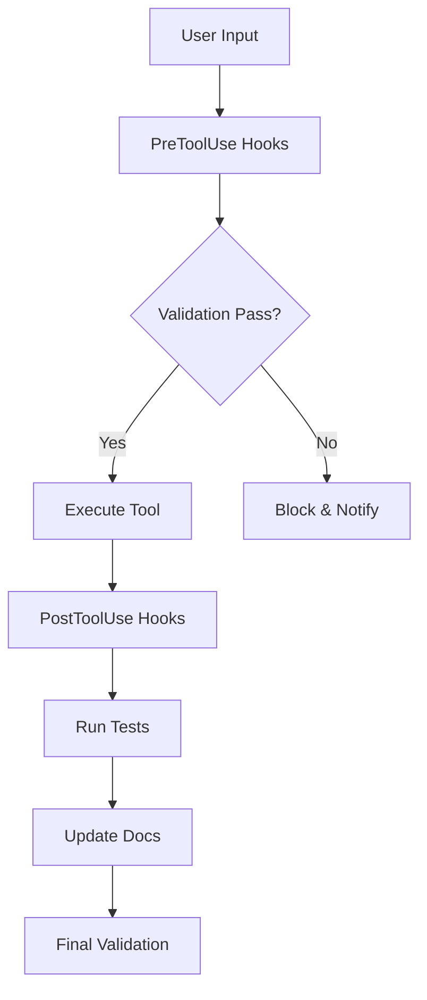

# 🔊 Text-to-Speech Extension - Claude Code Hooks

This directory contains Claude Code hooks specifically configured for the Text-to-Speech Browser Extension project. These hooks ensure consistent development workflow, code quality, and extension-specific validations during the implementation phase.

## 🎯 Project-Specific Hook System

### What are Hooks?

Hooks are user-defined shell commands that execute at specific points in Claude Code's lifecycle. For this TTS extension project, they:
- Ensure Manifest V3 compliance
- Validate cross-browser compatibility
- Check AI service integrations
- Monitor performance and memory usage
- Enforce extension security policies

## 📁 Current Hook Files

1. **hook-config.json** - Main hooks configuration (deprecated, use settings.local.json)
2. **tts-extension-hooks.sh** - Core TTS extension validation hooks
3. **manifest-validator.sh** - Manifest V3 compliance checker
4. **ai-service-validator.sh** - AI API integration validator
5. **cross-browser-checker.sh** - Browser compatibility validator
6. **performance-monitor.sh** - Performance and memory usage monitor
7. **security-validator.sh** - Extension security and CSP validator

## 🚀 Active Hooks for TTS Extension

### Pre-Tool Hooks (Before Execution)
- **Dangerous Command Blocker**: Prevents accidental deletion of critical files
- **Manifest Validator**: Checks manifest.json changes for V3 compliance
- **CSP Validator**: Ensures Content Security Policy compliance
- **Permission Checker**: Validates minimal permission usage

### Post-Tool Hooks (After Execution)
- **File Edit Logger**: Tracks all file modifications for audit
- **Test Trigger**: Runs relevant tests after code changes
- **Build Validator**: Ensures extension still builds after changes
- **Performance Check**: Monitors bundle size and memory usage

### User Prompt Hooks
- **TTS Context Reminder**: Adds TTS-specific context to prompts
- **Cross-Browser Reminder**: Reminds about browser compatibility
- **Accessibility Checker**: Ensures WCAG compliance considerations

### Subagent Integration Hooks
- **Validation Gates**: Integrates with validation-gates subagent
- **Documentation Manager**: Updates docs when code changes
- **Test Runner**: Triggers appropriate test suites

## 🔧 Extension-Specific Validations

### Manifest V3 Compliance
```bash
# Automatically validates manifest.json for:
- Service worker instead of background scripts
- No remote code execution
- Proper permission declarations
- Content security policy compliance
```

### Cross-Browser Compatibility
```bash
# Checks for browser-specific APIs:
- Chrome Extension APIs
- Firefox WebExtensions
- Safari Web Extensions
- Edge compatibility
```

### AI Service Integration
```bash
# Validates AI service configurations:
- Groq API key presence and format
- Claude API integration
- Rate limiting implementation
- Fallback mechanisms
```

### Performance Monitoring
```bash
# Tracks extension performance:
- Bundle size < 2MB
- Memory usage < 50MB
- Load time < 500ms
- TTS response time < 200ms
```

## 📝 Hook Configuration

The hooks are configured in `.claude/settings.local.json` with the following structure:

```json
{
  "hooks": {
    "PreToolUse": [...],
    "PostToolUse": [...],
    "UserPromptSubmit": [...],
    "SubagentStop": [...]
  }
}
```

## 🎨 Available Hook Events

| Event | Description | TTS Extension Use |
|-------|-------------|-------------------|
| **PreToolUse** | Before tool execution | Validate manifest, check permissions |
| **PostToolUse** | After tool success | Run tests, check builds |
| **UserPromptSubmit** | When prompt submitted | Add TTS context |
| **SubagentStop** | When subagent completes | Validate extension |
| **Stop** | When agent finishes | Final validation |
| **Notification** | System notifications | Alert on issues |
| **PreCompact** | Before context compact | Save important context |
| **SessionStart** | Session initialization | Load TTS configs |

## 🛠️ Creating Custom TTS Hooks

### Template for TTS Extension Hook

```bash
#!/bin/bash
# TTS Extension Hook Template

# Read JSON input from stdin
input=$(cat)

# Extract relevant information
tool_name=$(echo "$input" | jq -r '.tool_name // empty')
file_path=$(echo "$input" | jq -r '.file_path // empty')

# TTS-specific validation
if [[ "$file_path" == *"manifest.json"* ]]; then
  # Validate Manifest V3 compliance
  if grep -q "manifest_version.*2" "$file_path" 2>/dev/null; then
    echo '{"action": "block", "message": "Manifest V2 detected! TTS extension requires Manifest V3"}'
    exit 0
  fi
fi

# Check for TTS-specific requirements
if [[ "$file_path" == *"content-script.js"* ]]; then
  # Ensure no eval() or inline scripts (CSP compliance)
  if grep -E "eval\(|innerHTML.*=.*<script" "$file_path" 2>/dev/null; then
    echo '{"action": "warn", "message": "CSP violation detected in content script"}'
  fi
fi

# Success - allow operation
echo "{}"
```

### Making Hooks Executable

```bash
chmod +x .claude/hooks/*.sh
```

## 🔒 Security Considerations

- Hooks validate all extension permissions
- Prevent inline scripts and eval() usage
- Check for secure API key storage
- Validate content security policies
- Monitor for XSS vulnerabilities

## 🧪 Testing Hooks

Run Claude Code with debug flag to see hook execution:

```bash
claude --debug
```

This shows:
- Which hooks are triggered
- Input/output for each hook
- Validation results
- Performance metrics

## 📊 TTS Development Workflow Integration

### 1. **Browser Extension Development**
- Validates Manifest V3 structure
- Checks service worker implementation
- Ensures proper content script injection

### 2. **Text-to-Speech Implementation**
- Validates Web Speech API usage
- Checks voice availability
- Monitors speech synthesis performance

### 3. **AI Service Integration**
- Validates API key configuration
- Checks rate limiting implementation
- Ensures fallback mechanisms

### 4. **Cross-Browser Testing**
- Chrome 88+ compatibility
- Firefox 78+ WebExtensions
- Safari 14+ Web Extensions
- Edge 88+ support

### 5. **Accessibility Compliance**
- WCAG 2.1 AA validation
- Keyboard navigation checks
- Screen reader compatibility

### 6. **Performance Optimization**
- Bundle size monitoring
- Memory usage tracking
- Load time validation

## 🚨 Common Hook Warnings

| Warning | Cause | Solution |
|---------|-------|----------|
| CSP Violation | Inline scripts detected | Move to external files |
| Memory Limit | >50MB usage | Optimize resources |
| Permission Excess | Too many permissions | Use minimal permissions |
| API Key Missing | No Groq/Claude key | Add to .env file |
| Manifest Invalid | V2 or syntax error | Update to V3 format |

## 💡 Best Practices

1. **Always validate manifest.json** changes
2. **Test cross-browser after major changes**
3. **Monitor bundle size continuously**
4. **Check accessibility on UI changes**
5. **Validate API integrations regularly**
6. **Run security checks before commits**

## 🔄 Hook Execution Flow



## 📈 Performance Impact

Hooks are designed to be lightweight:
- Execution time: <100ms per hook
- Memory overhead: <5MB
- No blocking operations
- Async where possible

## 🆘 Troubleshooting

### Hook Not Executing
1. Check file permissions: `ls -la .claude/hooks/`
2. Verify hook registration in settings.local.json
3. Enable debug mode: `claude --debug`

### Validation Failures
1. Review hook output in debug mode
2. Check specific validation criteria
3. Fix identified issues
4. Re-run validation

### Performance Issues
1. Profile hook execution time
2. Optimize shell commands
3. Use caching where appropriate
4. Consider async execution

## 📚 Resources

- [Claude Code Hooks Documentation](https://docs.anthropic.com/claude-code/hooks)
- [Manifest V3 Migration Guide](https://developer.chrome.com/docs/extensions/mv3/intro/)
- [WebExtensions API](https://developer.mozilla.org/en-US/docs/Mozilla/Add-ons/WebExtensions)
- [Web Speech API](https://developer.mozilla.org/en-US/docs/Web/API/Web_Speech_API)

---

*These hooks are specifically optimized for the Text-to-Speech Browser Extension project to ensure quality, compatibility, and performance throughout the development lifecycle.*
