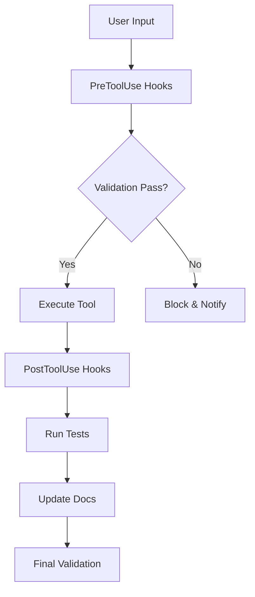

# 🔊 Text-to-Speech Extension - Claude Code Hooks

This directory contains Claude Code hooks specifically configured for the Text-to-Speech Browser Extension project. These hooks ensure consistent development workflow, code quality, and extension-specific validations during the implementation phase.

## 🎯 Project-Specific Hook System

### What are Hooks?

Hooks are user-defined shell commands that execute at specific points in Claude Code's lifecycle. For this TTS extension project, they:
- Ensure Manifest V3 compliance
- Validate cross-browser compatibility
- Check AI service integrations
- Monitor performance and memory usage
- Enforce extension security policies

## 📁 Current Hook Files

1. **hook-config.json** - Main hooks configuration with all hook definitions and triggers
2. **working-hook.sh** - Lightweight activity tracker and basic safety checks for dangerous commands
3. **tts-extension-hooks.sh** - Core TTS extension validation including CSP, Manifest V3, and performance checks
4. **log-tool-usage.sh** - Comprehensive file edit tracking with TTS-specific categorization and statistics
5. **manifest-validator.sh** - Comprehensive Manifest V3 compliance checker with detailed validation rules
6. **ai-service-validator.sh** - AI service integration validator covering security, rate limiting, and best practices
7. **cross-browser-checker.sh** - Cross-browser compatibility checker for Chrome, Firefox, Safari, and Edge

## 🚀 Active Hooks for TTS Extension

### Pre-Tool Hooks (Before Execution)
- **Dangerous Command Blocker**: Prevents deletion of critical files (API keys, secrets)
- **Manifest V3 Reminder**: Shows info when editing manifest.json files
- **API Key Protection**: Blocks commands that could expose sensitive data

### Post-Tool Hooks (After Execution)
- **TTS Extension Validator**: Comprehensive validation suite including:
  - Manifest V3 compliance checking
  - Content Security Policy validation
  - TTS implementation checks
  - AI service integration validation
  - Cross-browser compatibility checks
  - Performance monitoring
  - Memory leak prevention
  - Accessibility validation
- **AI Service Validator**: Specific checks for Groq, Claude, OpenAI integrations
- **Cross-Browser Checker**: Chrome/Firefox/Safari/Edge compatibility validation
- **File Edit Logger**: Categorized tracking of all file modifications

### User Prompt Hooks
- **TTS Testing Reminder**: Shows comprehensive testing checklist when test-related prompts detected
- **TTS Context Provider**: Adds speechSynthesis API context for TTS-related prompts
- **AI Service Context**: Provides rate limit information for AI service prompts

### Session Management Hooks
- **Session Start**: Shows project context and browser compatibility targets
- **Session End**: Displays final validation checklist
- **Subagent Integration**: Logs completion of validation-gates and documentation-manager

## 🔧 Extension-Specific Validations

### Manifest V3 Compliance (manifest-validator.sh)
- ✅ Enforces Manifest V3 (blocks V2)
- ✅ Validates service worker configuration
- ✅ Checks required fields (name, version, description)
- ✅ Validates permissions and host_permissions
- ✅ Ensures proper Content Security Policy format
- ✅ Validates action API (blocks deprecated browser_action)
- ✅ Checks icon requirements (128x128 for stores)
- ✅ Validates web_accessible_resources V3 format

### Cross-Browser Compatibility (cross-browser-checker.sh)
- 🌐 Detects Chrome-only APIs and suggests webextension-polyfill
- 🦊 Validates Firefox Promise-based APIs vs Chrome callbacks
- 🧭 Checks Safari speechSynthesis voice loading issues
- 📱 Validates mobile browser compatibility
- 🎨 Checks CSS vendor prefixes and modern features
- 📊 Provides browser version compatibility matrix

### AI Service Integration (ai-service-validator.sh)
- 🚨 **BLOCKS** hardcoded API keys in source code (sk-, gsk_, anthropic_ patterns)
- 📊 Validates rate limiting implementation for Groq (100/hr), Claude (60/min), OpenAI (60/min)
- 🔧 Checks error handling patterns (try-catch, .catch(), .then() with error handling)
- 💡 Suggests fallback mechanisms between multiple AI services
- 🔐 Validates privacy compliance and user consent mechanisms
- 📝 Checks token limits and model configurations for each service
- 💾 Suggests response caching and retry logic implementation
- 🔗 Validates correct API endpoints for each service

### TTS-Specific Validations (tts-extension-hooks.sh)
- 🎤 Validates speechSynthesis API error handling and implementation
- 🔄 Checks utterance lifecycle management (onend, cancel, pause)
- 🧹 Prevents memory leaks from event listeners and intervals (with cleanup checks)
- ♿ Validates accessibility (ARIA labels, keyboard navigation, screen reader support)
- 📦 Monitors file sizes (warns at >100KB for performance)
- 🔒 **BLOCKS** CSP violations (eval(), inline scripts, innerHTML with script tags)
- 🌐 Cross-browser compatibility warnings for chrome.* vs browser.* APIs
- 📋 Manifest V3 compliance validation and service worker checks
- 🧪 Testing reminders for critical file modifications

## 📝 Hook Configuration

The hooks are configured in `hook-config.json` and follow this structure:

```json
{
  "hooks": {
    "PreToolUse": [
      {
        "matcher": "Bash|Edit|Write",
        "hooks": [
          {
            "type": "command",
            "command": ".claude/hooks/script-name.sh",
            "description": "Hook description"
          }
        ]
      }
    ],
    "PostToolUse": [...],
    "UserPromptSubmit": [...],
    "SessionStart": [...],
    "Stop": [...]
  }
}
```

## 📊 Hook Execution Flow

### Current Active Hook Triggers:

**PreToolUse:**
- Bash commands → Dangerous command blocker + API key protection
- Edit/Write operations → Manifest V3 reminder

**PostToolUse:**
- Edit/Write/MultiEdit → Comprehensive validation suite:
  - tts-extension-hooks.sh (main validator with CSP, TTS, accessibility, and performance checks)
  - manifest-validator.sh (Manifest V3 compliance validation)
  - ai-service-validator.sh (AI service security and rate limiting validation)
  - cross-browser-checker.sh (cross-browser compatibility analysis)
  - log-tool-usage.sh (file edit tracking with TTS-specific categorization)

**UserPromptSubmit:**
- Test-related prompts → Testing reminder with checklist
- TTS-related prompts → speechSynthesis API context
- AI-related prompts → Rate limit information

**SessionStart:**
- Shows project context and browser targets

**SubagentStop:**
- Validation-gates completion logging
- Documentation-manager reminders

**Stop:**
- Final validation checklist

## 🎨 Available Hook Events

| Event | Description | TTS Extension Use |
|-------|-------------|-------------------|
| **PreToolUse** | Before tool execution | Validate manifest, check permissions |
| **PostToolUse** | After tool success | Run tests, check builds |
| **UserPromptSubmit** | When prompt submitted | Add TTS context |
| **SubagentStop** | When subagent completes | Validate extension |
| **Stop** | When agent finishes | Final validation |
| **Notification** | System notifications | Alert on issues |
| **PreCompact** | Before context compact | Save important context |
| **SessionStart** | Session initialization | Load TTS configs |

## 🛠️ Creating Custom TTS Hooks

### Template for TTS Extension Hook

```bash
#!/bin/bash
# TTS Extension Hook Template

# Read JSON input from stdin
input=$(cat)

# Extract relevant information
tool_name=$(echo "$input" | jq -r '.tool_name // empty')
file_path=$(echo "$input" | jq -r '.file_path // empty')

# TTS-specific validation
if [[ "$file_path" == *"manifest.json"* ]]; then
  # Validate Manifest V3 compliance
  if grep -q "manifest_version.*2" "$file_path" 2>/dev/null; then
    echo '{"action": "block", "message": "Manifest V2 detected! TTS extension requires Manifest V3"}'
    exit 0
  fi
fi

# Check for TTS-specific requirements
if [[ "$file_path" == *"content-script.js"* ]]; then
  # Ensure no eval() or inline scripts (CSP compliance)
  if grep -E "eval\(|innerHTML.*=.*<script" "$file_path" 2>/dev/null; then
    echo '{"action": "warn", "message": "CSP violation detected in content script"}'
  fi
fi

# Success - allow operation
echo "{}"
```

### Making Hooks Executable

```bash
chmod +x .claude/hooks/*.sh
```

### Current Hook Execution Order

When you edit a file, the hooks execute in this sequence:

1. **PreToolUse hooks** (before file modification):
   - Dangerous command blocker for Bash operations
   - Manifest V3 reminder for manifest.json edits

2. **PostToolUse hooks** (after file modification):
   - `tts-extension-hooks.sh` - Core validation (CSP, TTS, accessibility, memory)
   - `manifest-validator.sh` - Manifest V3 compliance checking  
   - `ai-service-validator.sh` - AI service security and rate limiting
   - `cross-browser-checker.sh` - Browser compatibility analysis
   - *(Note: log-tool-usage.sh is not currently in hook-config.json but should be added)*

## 🔒 Security Considerations

- Hooks validate all extension permissions
- Prevent inline scripts and eval() usage
- Check for secure API key storage
- Validate content security policies
- Monitor for XSS vulnerabilities

## 🧪 Testing Hooks

Run Claude Code with debug flag to see hook execution:

```bash
claude --debug
```

This shows:
- Which hooks are triggered
- Input/output for each hook
- Validation results
- Performance metrics

## 📊 TTS Development Workflow Integration

### File Edit Categorization (log-tool-usage.sh)

The hooks automatically categorize file edits to provide context-aware logging:

| File Pattern | Category | Log Message | Recommendation |
|-------------|----------|-------------|----------------|
| `manifest.json` | Extension manifest | 📋 Extension manifest modified | Validate V3 compliance |
| `content-script.js`, `content.js` | Content script | 🌐 Content script modified - affects text selection | Test text selection overlay |
| `service-worker.js`, `background.js` | Background service | ⚙️ Background service modified - affects extension core | Test extension lifecycle |
| `*tts*`, `*speech*` | TTS service | 🎤 TTS service modified - affects speech synthesis | Test speech functionality |
| `*ai*`, `*groq*`, `*claude*` | AI service | 🤖 AI service modified - affects explanations | Test AI integrations |
| `*overlay*`, `*popup*`, `*ui*` | UI component | 🎨 UI component modified - affects user interface | Test user interactions |
| `*test*`, `*spec*` | Test file | 🧪 Test file modified - remember to run tests | Execute test suite |
| `*.css` | Styles | 🎨 Styles modified - check cross-browser rendering | Test in all browsers |
| `package.json` | Dependencies | 📦 Dependencies modified - run npm install | Update dependencies |
| `.env` | Environment | 🔐 Environment variables modified - check API keys | Verify secrets |

### 1. **Browser Extension Development**
- Validates Manifest V3 structure
- Checks service worker implementation
- Ensures proper content script injection

### 2. **Text-to-Speech Implementation**
- Validates Web Speech API usage
- Checks voice availability
- Monitors speech synthesis performance

### 3. **AI Service Integration**
- Validates API key configuration
- Checks rate limiting implementation
- Ensures fallback mechanisms

### 4. **Cross-Browser Testing**
- Chrome 88+ compatibility
- Firefox 78+ WebExtensions
- Safari 14+ Web Extensions
- Edge 88+ support

### 5. **Accessibility Compliance**
- WCAG 2.1 AA validation
- Keyboard navigation checks
- Screen reader compatibility

### 6. **Performance Optimization**
- Bundle size monitoring
- Memory usage tracking
- Load time validation

## 🚨 Common Hook Messages

### Blocking Messages (Prevent Execution)
| Message | Hook | Cause | Solution |
|---------|------|-------|----------|
| "Manifest V2 detected!" | manifest-validator.sh, tts-extension-hooks.sh | Using Manifest V2 | Upgrade to Manifest V3 |
| "API key detected in code!" | ai-service-validator.sh, tts-extension-hooks.sh | Hardcoded API key (sk-, gsk_, anthropic_) | Use environment variables or chrome.storage |
| "eval() is not allowed" | tts-extension-hooks.sh | CSP violation with eval() | Use alternative methods |
| "Security Risk: innerHTML with script" | tts-extension-hooks.sh | XSS vulnerability | Never inject scripts via innerHTML |
| "Dangerous command blocked" | working-hook.sh, hook-config.json PreToolUse | rm -rf / or API key echo | Use with extreme caution |

### Warning Messages (Allow but Alert)
| Message | Hook | Cause | Suggestion |
|---------|------|-------|------------|
| "No permissions declared" | manifest-validator.sh | Empty permissions | Add activeTab and storage |
| "Chrome-only API detected" | cross-browser-checker.sh, tts-extension-hooks.sh | Browser compatibility | Use webextension-polyfill or browser.* |
| "No rate limiting detected" | ai-service-validator.sh | API without throttling | Implement rate limiting for API calls |
| "Large file detected (>100KB)" | tts-extension-hooks.sh | Performance concern | Consider code splitting |
| "TTS implementation should include error handling" | tts-extension-hooks.sh | Missing error handling | Add try-catch for speechSynthesis |
| "Remember to remove event listeners" | tts-extension-hooks.sh | Memory leak prevention | Add removeEventListener cleanup |
| "Add ARIA labels for accessibility" | tts-extension-hooks.sh | Accessibility compliance | Add aria-label and role attributes |

### Info Messages (Helpful Reminders)
| Message | Hook | Purpose |
|---------|------|---------|
| "Manifest V3 validation passed!" | manifest-validator.sh | Confirmation of compliance |
| "Critical file modified" | tts-extension-hooks.sh | Test reminder for key files |
| "TTS Testing Reminder" | UserPromptSubmit hook | Show comprehensive test checklist |
| "Session Complete" | Stop hook | Final validation checklist |
| "Consider implementing fallback" | ai-service-validator.sh | AI service redundancy |
| "Token Limits" info | ai-service-validator.sh | Model context limits |
| "Browser compatibility" notes | cross-browser-checker.sh | Cross-browser tips |

## 💡 Best Practices

1. **Always validate manifest.json** changes
2. **Test cross-browser after major changes**
3. **Monitor bundle size continuously**
4. **Check accessibility on UI changes**
5. **Validate API integrations regularly**
6. **Run security checks before commits**

## 🔄 Hook Execution Flow



## 📈 Performance Impact

Hooks are designed to be lightweight:
- Execution time: <100ms per hook
- Memory overhead: <5MB
- No blocking operations
- Async where possible

## 🆘 Troubleshooting

### Hook Not Executing
1. **Check file permissions**: `ls -la .claude/hooks/`
   ```bash
   chmod +x .claude/hooks/*.sh  # Make all hooks executable
   ```

2. **Verify hook registration**: Check `hook-config.json` structure
   ```bash
   cat .claude/hooks/hook-config.json | jq '.hooks'  # View hook configuration
   ```

3. **Enable debug mode**: 
   ```bash
   claude --debug  # See detailed hook execution
   ```

### Missing Hook Registration

**Note**: The `log-tool-usage.sh` script exists but is not currently registered in `hook-config.json`. To enable file edit logging, add this to the PostToolUse hooks:

```json
{
  "type": "command",
  "command": ".claude/hooks/log-tool-usage.sh",
  "description": "Log file edits with TTS-specific categorization"
}
```

### Common Hook Issues

**🔧 "Permission denied" Error:**
```bash
chmod +x .claude/hooks/tts-extension-hooks.sh
chmod +x .claude/hooks/manifest-validator.sh
chmod +x .claude/hooks/ai-service-validator.sh
chmod +x .claude/hooks/cross-browser-checker.sh
chmod +x .claude/hooks/log-tool-usage.sh
chmod +x .claude/hooks/working-hook.sh
```

**📁 Log Files Not Created:**
- Hooks create `.claude/logs/` directory automatically
- Check write permissions in project directory
- View logs: `cat .claude/logs/tts-extension-hooks.log`

**⚡ Hook Taking Too Long:**
- Each hook is designed to complete in <100ms
- Check `.claude/logs/hook-activity.log` for performance issues
- Hooks use grep/shell commands for speed (no jq dependency)

### Validation Failures
1. **Review hook output**: `cat .claude/logs/manifest-validation.log`
2. **Check specific files**: Look at file mentioned in error
3. **Fix identified issues**: Follow hook suggestions
4. **Re-run validation**: Edit/save file to trigger hooks again

### Log Files Location
```
.claude/logs/
├── hook-activity.log           # General hook activity from working-hook.sh
├── tts-extension-hooks.log     # Main TTS validation log from tts-extension-hooks.sh
├── manifest-validation.log     # Manifest V3 validation results from manifest-validator.sh
├── ai-service-validation.log   # AI service check results from ai-service-validator.sh
├── browser-compatibility.log   # Cross-browser compatibility from cross-browser-checker.sh
├── file-edits.log             # File modification tracking from log-tool-usage.sh
├── tts-development.log        # Categorized development activity with emojis
├── tts-quick-log.log          # Quick logging from working-hook.sh
└── modification-stats.txt     # Development statistics by category
```

## 🔧 Hook Development Guide

### Adding New Hooks

1. **Create the hook script** in `.claude/hooks/`
2. **Make it executable**: `chmod +x your-hook.sh`
3. **Register in hook-config.json**:
   ```json
   {
     "matcher": "Edit|Write",
     "hooks": [{
       "type": "command", 
       "command": ".claude/hooks/your-hook.sh",
       "description": "Your hook description"
     }]
   }
   ```

### Hook Input/Output Format

**Input JSON** (from stdin):
```json
{
  "tool_name": "Edit",
  "tool_input": {
    "file_path": "/path/to/file.js",
    "command": "npm test"
  }
}
```

**Output JSON** (to stdout):
```json
{
  "action": "block|warn|info|allow",
  "message": "Human readable message"
}
```

### Best Practices for TTS Extension Hooks

1. **Performance**: Complete in <100ms
2. **Compatibility**: Use `grep` instead of `jq` for parsing
3. **Logging**: Always log to `.claude/logs/`
4. **Safety**: Return `{}` for success to avoid blocking
5. **Specific**: Target TTS extension needs (Manifest V3, speechSynthesis, AI APIs)

## 📚 Resources

### Hook Development
- [Claude Code Hooks Documentation](https://docs.anthropic.com/claude-code/hooks)
- [Shell Scripting Best Practices](https://www.gnu.org/software/bash/manual/bash.html)

### Extension Development
- [Manifest V3 Migration Guide](https://developer.chrome.com/docs/extensions/mv3/intro/)
- [WebExtensions API](https://developer.mozilla.org/en-US/docs/Mozilla/Add-ons/WebExtensions)
- [Web Speech API](https://developer.mozilla.org/en-US/docs/Web/API/Web_Speech_API)

### AI Services
- [Groq API Documentation](https://console.groq.com/docs)
- [Claude API Documentation](https://docs.anthropic.com/claude/reference)
- [OpenAI API Documentation](https://platform.openai.com/docs)

---

*These hooks are specifically optimized for the Text-to-Speech Browser Extension project, providing comprehensive validation, security checks, and development workflow automation to ensure quality and compatibility across all target browsers and AI services.*
